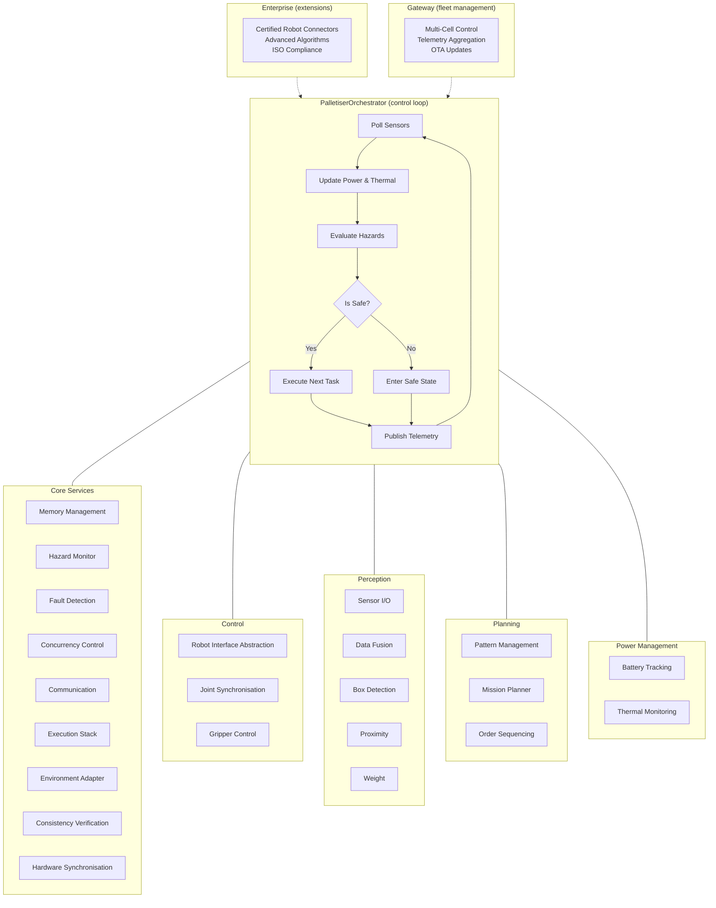

# Palletizer Full Stack

**The open‑source software foundation for high‑throughput end‑of‑line palletising cells.**  
One codebase. Any robot arm. Any gripper. Any factory.

[](https://www.python.org/downloads/)
[](LICENSE)
[](https://github.com/psf/black)
[](https://github.com/iceccarelli/palletizer/actions)
[](https://github.com/iceccarelli/palletizer)

---

## 📋 Table of Contents

- [Why This Exists](#why-this-exists)
- [Architecture](#architecture)
- [Quick Start](#quick-start)
- [How It Works](#how-it-works)
- [Integrating Your Robot](#integrating-your-robot)
- [Configuration](#configuration)
- [Examples](#examples)
- [Testing](#testing)
- [Contributing](#contributing)
- [License](#license)
- [Roadmap](#roadmap)

---

## Why This Exists

Palletising accounts for over half of all industrial robot installations worldwide, yet there is no widely adopted open‑source software stack that engineers can use as a starting point. Every integrator rebuilds the same control loops, safety checks, and planning logic from scratch.

**Palletizer Full Stack** changes that. It provides a complete, modular, hardware‑agnostic software architecture that you can adapt to your robot, your gripper, and your factory floor in hours rather than weeks.

---

## Architecture

The stack is organised into six packages, each responsible for a distinct concern. Packages communicate through well‑defined interfaces, so you can replace or extend any layer without touching the others.



| Package | Purpose |
|:---|:---|
| **core/** | Foundational services: memory management, hazard monitoring, fault detection, concurrency, communication, execution stack, environment adaptation, consistency verification, hardware synchronisation |
| **control/** | Low‑level motion: robot interface abstraction, joint synchronisation, gripper control with retry logic and pressure feedback |
| **perception/** | Sensor I/O and processing: raw data acquisition and fusion for box detection, proximity, and weight |
| **planning/** | Task planning: pattern management for stacking layouts, mission planner for order sequencing |
| **power/** | Energy and thermal management: battery state‑of‑charge tracking, thermal monitoring with hysteresis‑based cooling |
| **enterprise/** | Reserved for enterprise‑grade connectors and algorithms (see `enterprise/README.md`) |
| **gateway/** | Reserved for the hosted multi‑cell control plane (see `gateway/README.md`) |

---

## Quick Start

```bash
# Clone the repository
git clone https://github.com/iceccarelli/palletizer.git
cd palletizer

# Install in development mode with all extras
pip install -e ".[dev]"

# Run the demo with a dummy robot
python -m palletizer_full.run

# Run the test suite
pytest -v
```

---

## How It Works

The `PalletiserOrchestrator` is the central coordinator. It instantiates every subsystem, wires them together, and runs a deterministic control loop via the `ExecutionStack`. Each cycle follows this sequence:

1. **Poll sensors** – the perception pipeline reads raw data and fuses it into structured signals.
2. **Update power and thermal** – battery state‑of‑charge and actuator temperatures are tracked.
3. **Evaluate hazards** – proximity, voltage, gas, and fault signals are checked against safety thresholds.
4. **Execute tasks** – if the cell is safe and there are pending orders, the planner dispatches the next pick‑and‑place operation.
5. **Publish telemetry** – health metrics are collected and sent via the communication interface.

The loop frequency is configurable (default 50 Hz) and strictly enforced to guarantee deterministic behaviour.

---

## Integrating Your Robot

The stack is hardware‑agnostic. To connect your robot arm, implement the `RobotInterface` abstract class:

```python
from palletizer_full.control.motion_controller import RobotInterface

class MyRobotSDK(RobotInterface):
    def get_joint_positions(self) -> tuple[float, ...]:
        return self._sdk.read_joints()

    def command_joint_positions(self, positions: tuple[float, ...]) -> None:
        self._sdk.move_joints(positions)

    def execute_trajectory(self, trajectory, dt):
        for pos in trajectory:
            self.command_joint_positions(pos)
            time.sleep(dt)
```

Pass your implementation to the orchestrator, and the rest of the stack works unchanged. The same principle applies for grippers, sensors, and any other hardware.

---

## Configuration

All parameters can be overridden via environment variables. No code changes are needed to adapt the system to a different factory environment.

| Variable | Default | Description |
|:---|:---|:---|
| `CYCLE_HZ` | `50.0` | Control loop frequency (Hz) |
| `BATTERY_CAPACITY_WH` | `1000.0` | Total energy capacity (Wh) |
| `LOW_BATTERY_THRESHOLD` | `0.2` | Fractional charge level for low‑battery alert |
| `MAX_TEMPERATURE_C` | `70.0` | Maximum safe temperature (°C) |
| `SAFETY_MARGIN_M` | `0.4` | Minimum distance to obstacles (m) |
| `PALLETIZER_ENV` | `FACTORY` | Environment profile (affects sensor noise, etc.) |
| `PALLETIZER_SIM` | `false` | Enable simulator mode (disables real hardware) |

See `config.py` and `robot_config.py` for the full list.

---

## Examples

The `examples/` directory contains working demonstrations:

| Example | Description |
|:---|:---|
| `basic_palletise.py` | Wire up a dummy robot, register a pattern, and run a palletising cycle |
| `custom_gripper.py` | Integrate a vacuum gripper with pressure feedback |
| `monitoring_telemetry.py` | Collect and inspect telemetry from battery, thermal, and fault subsystems |

Run any example with `python examples/<example_name>.py`.

---

## Testing

The project includes a comprehensive test suite covering all core modules:

```bash
pytest -v
```

To run tests with coverage:

```bash
pytest --cov=palletizer_full tests/
```

---

## Contributing

We welcome contributions from robotics engineers, automation specialists, and anyone interested in open‑source industrial software. Whether it’s a bug fix, a new sensor driver, or improved documentation, your help is appreciated.

Please read [CONTRIBUTING.md](CONTRIBUTING.md) for guidelines.

---

## License

This project is licensed under the Apache License 2.0. See [LICENSE](LICENSE) for details.

---

## Roadmap

We are building this in the open and invite the community to shape the direction. Near‑term priorities include:

- Vision‑based box detection using depth cameras
- ROS 2 integration for teams already using the Robot Operating System
- OPC UA communication for seamless PLC interoperability
- Web‑based monitoring dashboard for real‑time cell status
- Additional robot SDK connectors (UR, KUKA, ABB, Fanuc)

If any of these are important to you, open an issue and let us know.
